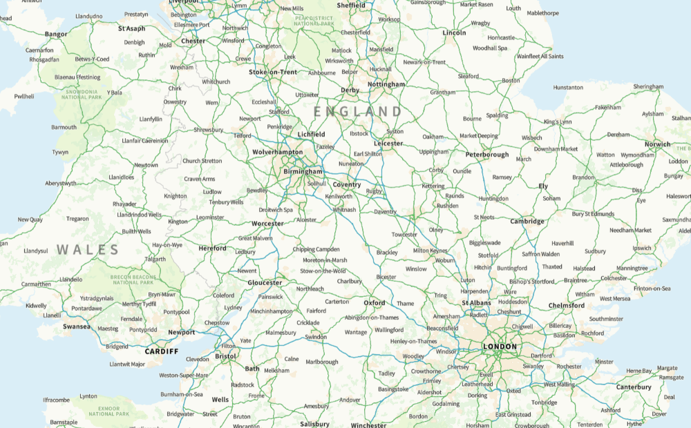
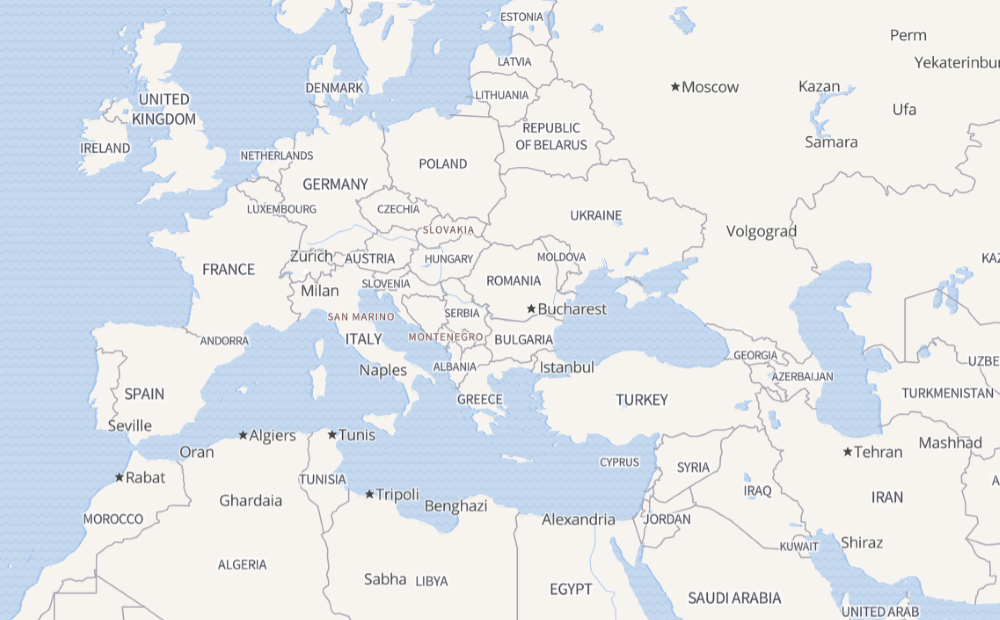
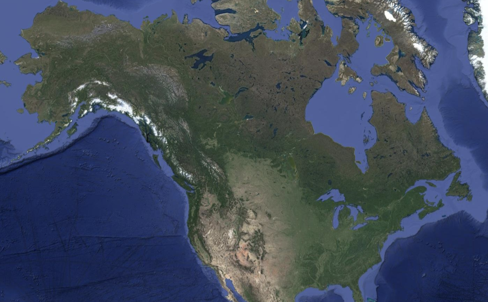

# Tile-Docker

Docker compose file to start a tileserver-gl instance serving high level World imagery, Ordnance Survey Open ZoomStack, and Open Street Map styled data.

## Usage

 - Clone repo
 
 - Download OS Open ZoomStack data from Ordnance Survey and place in `src/mbtiles` 
    
    https://www.ordnancesurvey.co.uk/products/os-open-zoomstack#get
 
 - `docker compose up`

## Screenshots

